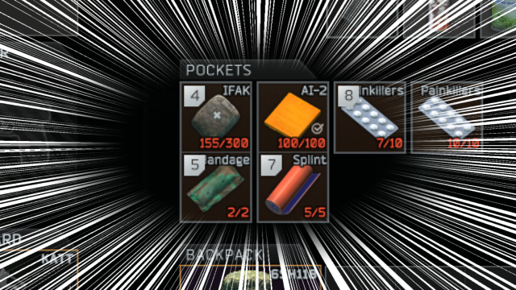

Customizin' Containers (for JET v1.1.0) 
----------------
Version `1.1.0` (`03.13.2021`)
By Kyodan

This mod allows you to resize all containers in the game (including pockets), and can remove restrictions from backpacks and secure cases!

**Download the latest release (in ZIP format) here: https://github.com/KyodanCFG/CustomizinContainers/releases**
                                                                             
## Info

- By default, this mod changes the following:
    * Two pockets will be `2` units tall
    * Junk Box will be `12x16` units (easier to see inventory)
    * Mag Case will be `6x8` units 
    * Weapons Case will be `6x10` units 
    * Item restrictions in backpacks and secure cases will be `ON`

## Installation

1. Extract archive to your `server folder/user/mods` folder 
    * Folder structure should look like `server folder/user/mods/Kyodan-CustomizinContainers-X.X.X`
2. Close your server (if it's running)
3. Edit `settings.json` in your preferred text editor/IDE, review/modify any settings, then save and close
4. Delete your `server folder/user/cache` folder
5. Run your server (it should generate a new cache)

* If you change a setting in `settings.json`, repeat steps 2-5 above
* `settings_default.json` is a backup file that contains default container settings from Live

## Settings

- Below are the flags for each setting:
    * `customizinContainers` (true|false)       - determines if this script is enabled/disabled
    * `removeRestrictions` (true|false)         - determines if restrictions are removed from secure cases
    * `width` (number)                          - determines how many units wide the container will be
                                                (recommend to set less than 28)
    * `height` (number)                         - determines how many units tall the container will be
                                                (recommend to set less than 16)

## Files

- If any of the files below are missing/misplaced, you may have to redownload/reinstall this archive:
    * `src/Customizin.js`
    * `mod.config.json`
    * `settings.json`
    * `settings_default.json`
    * `readme.md`   

## Need help?

1. Join the EmuTarkov Discord: https://discord.gg/33r4FPp
2. @ me in the #support channel which script + version, what the issue is, and a picture/log of that issue (if possible)

## Disclaimer

I am not responsible for any data loss in relation to the use of this mod (including, but not limited to game/profile data and/or content loss, damage caused to your software, computer, or mobile device). I encourage you to back up your server/profile data before using this mod.

## Changelog

- 03.13.21
    * Added `removeRestrictions` option for backpacks and secure cases

- 02.05.21
    * Fixed Kappa case sizing incorrectly to Gamma variables
